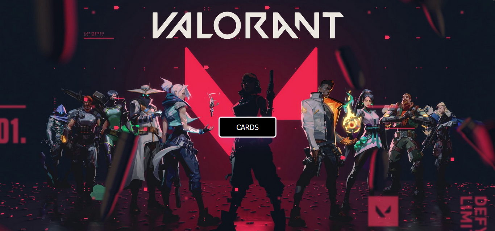
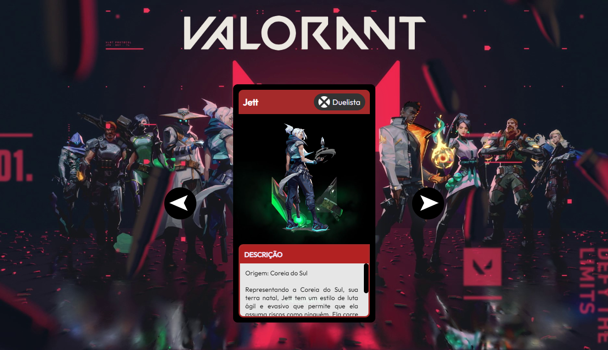

<h1 align="center">Projeto Cards Valorant</h1>
 

## 💻 Sobre o projeto:

Esse projeto foi desenvolvido com base no conhecimento adquirido durante a **MAPADEV WEEK** realizada pelo canal <a href="https://www.youtube.com/c/DevemDobro">**DEV em Dobro**</a>.
 
O objetivo do projeto era criar um slider de cards de diversos personagens, exibindo suas principais informações. 
  

## 🖌️ Layout:

O layout do projeto tem como tema o jogo **Valorant**, criado pela desenvolvedora Riot Games.
  

  

 

## 🛠 Tecnologias:

As seguintes tecnologias foram usadas no desenvolvimento do projeto:

  
  
  

 

## 💡 Como acessar o projeto:
#### Para acessar, basta clicar no link a seguir: .
<i>Durante o teste do projeto serão reproduzidas falas dos personagens, variando de acordo com o card em exibição.</i>
  

## 📝 Autora:
⚡ Emmanuelly Lavínia da Silva

